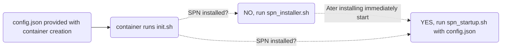

# SPN Community Node via Docker

The configuration of the docker image has to be supplied via a config.json file.
Example configuration:
```json
{
    "core": {
      "metrics": {
        "instance": "justsomeinstance",
        "comment": "docker instance build by NL-TCH",
        "push": ""
      }
    },
    "spn": {
      "publicHub": {
        "name": "justsomehub",
        "ip4": "123.12.1.123"
      }
    }
  }
```

For all configuration flags check https://docs.safing.io/spn/hosting-a-community-node#appendix-i-available-settings-for-spn-nodes

To run the docker container execute the following command:`docker run -v ./config.json:/data/config.json dockerteun/spn-community-node:latest`


Global overview docker container:


