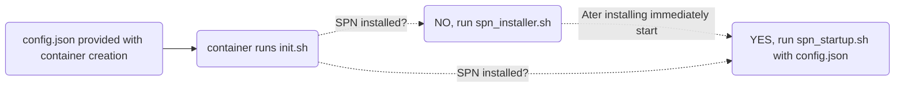

run: docker run -v ./config.json:/data/config.json image:latest

problem solved:
install spn when not installed, run when installed (after restarting) to prevent reinstalling after container reboot
provide config after building image, and not while, to create global usable image.

https://docs.safing.io/spn/hosting-a-community-node

SPN docker container script usage:

